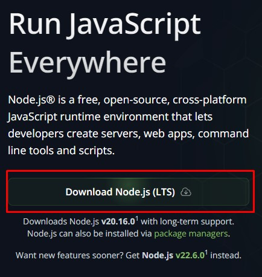
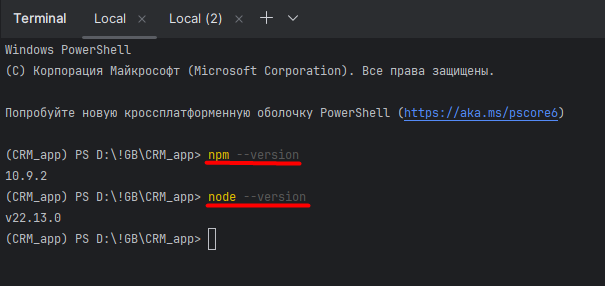

# Команды для начала работы
### Перед началом свяжись с руководителем чтобы тебя добавили в коллабу!
## Подключение репозитория
* ВАЖНО! git init
* git remote add origin https://github.com/scorp5438/CRM_web_app.git
## Смена основной ветки на "main"
* git branch -M main
## Загрузка проекта на компьютер
* git clone https://github.com/scorp5438/CRM_web_app.git main
* в дальнейшем для подтягивания изменений используем команду ***git pull***
* ВАЖНО! Первое получение обновлений происходит командой git pull в терминале
## Установка ПО для работы (проверь что в строке приглашения ты в корне всего проекта)
* pip install -r requirements.txt

## Установка `Node.js и npm` на Windows
1. **Установить Node.js и npm проще с официального сайта :**

https://nodejs.org/




Скачаваем последнюю LTS (Long-Term Support) версию.
Запускаем установщик и следуем инструкциям. Нужно убедиться, что опция "Установить npm" выбрана.  
После установки рекомендуется перезагрузить ПК!

2. Устанавливаем django командой ```pip install django```

2.1. Создание дампа базы данных в json файл. Файл сохраняется в том месте
откуда вызывается команда. Лучше делать в корне.
         ```python -Xutf8 manage.py dumpdata -o data.json```

2.2 Загрузка данных из файла data.json. Выполнять нужно там, где лежит сам файл
      ```python manage.py loaddata data.json```

3. **После того как Node.js и npm установлены, надо открыть терминал в PyCharm и проверить версии:**

        node --version
        npm --version




Эти команды должны вернуть установленные версии Node.js и npm, что будет означать успешную установку.

4. **Создание React приложения:**

          npm install react-scripts - для установки Реакт
          npm install react-router-dom - для установки реакт дом
          npm install axios
          npm install moment-timezone
          npm run build

В директории с файлом manage.py выполняется команда в терминале:

         python manage.py makemigrations
         python manage.py migrate
         python manage.py createsuperuser  # создание суперпользователя (root)
         # Добавить картинку
         python manage.py collectstatic --noinput


Данная команда собирает все статические файлы из разных приложений (в нашем случае из приложения `React`) и модулей и помещает в одну общую папку проекта `Django`.

5. **Команда для старта сервера на Django:**

         python manage.py runserver

После запуска наш проект работает на http://127.0.0.1:8000/


Для GIT IGNORE (Для того чтобы удалить db.sqlite3 из отслеживания)

          git rm --cached db.sqlite3

Если всё получилось, ПОЗДРАВЛЯЮ!
Для запуска сайта в последующем необходимо выполнить:
1. В окошке 1-ого терминала (путь в терминале `~\CRM_app\my-app`): 
```python
npm run build
```
2. В окошке 2-ого терминала (путь в терминале `~\CRM_app`): 
```python   
    python manage.py collectstatic --noinput
    python manage.py runserver
```

# TODO Дима просьба навести красоту в разделе с описание про запуск тестов ниже
3. Запуск тестов. Для запуска нужно находиться в той же папке, где находится файл manage.py
Для запуска всех тестов в приложении нужно набрать:```python manage.py test testing.tests```
где:
test - команда запуска, testing - приложение, tests файл с тестами

Для запуска конкретного класса в файле с тестами нужно набрать:```python manage.py test testing.tests.ExamApiViewTestCase```
ExamApiViewTestCase - название класса тестов

Для запуска конкретного теста в классе в файле с тестами, нужно набрать:```python manage.py test testing.tests.ExamApiViewTestCase.test_create_exam_valid_data```
test_create_exam_valid_data - название метода теста в классе